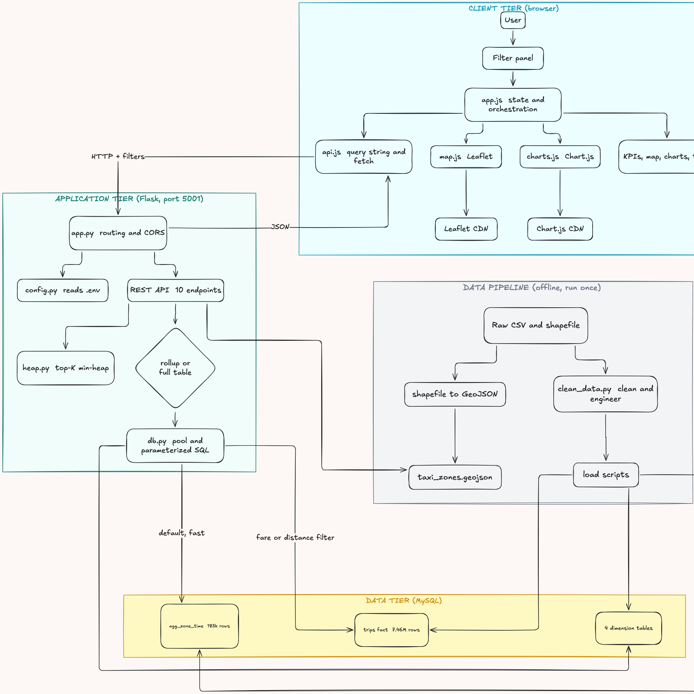
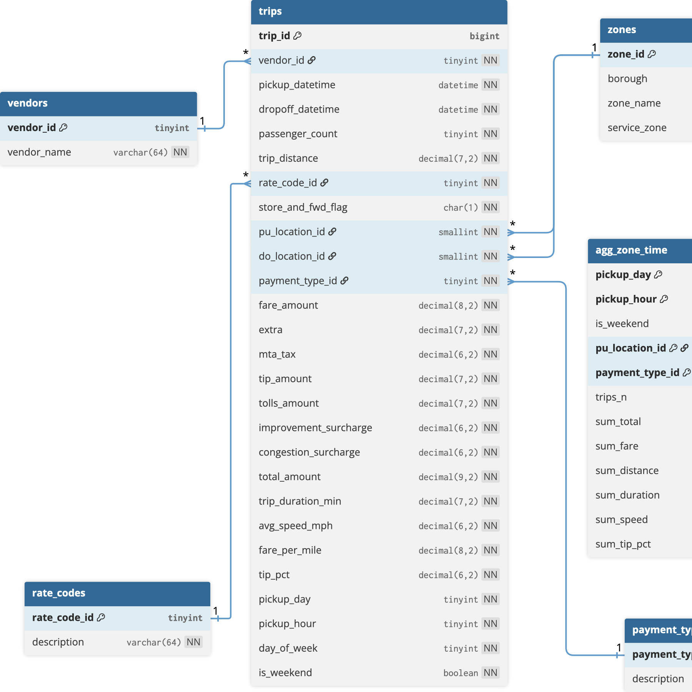

# Urban Mobility Data Explorer

A fullstack web application for exploring New York City Yellow Taxi trips
(January 2019, about 7.46M cleaned trips): a Python data-cleaning pipeline, a normalized
MySQL star schema, a Flask REST API, and an interactive dashboard with a
Leaflet zone map and Chart.js visualizations.

> **Video walkthrough:** https://youtu.be/KZA4qOaakus
>
> **Scrum board:** https://github.com/users/Alicia-Keza/projects/3/views/1
>
> **Team participation sheet:** https://docs.google.com/spreadsheets/d/1heKVYIhDbUfLTr7VTeSpSIK7N-6PLfcJM0Nu9bvkTBw/edit
>
> **AI usage log:** [AI_USAGE_LOG.md](AI_USAGE_LOG.md)

---

## Architecture



The browser calls a Flask REST API, which reads from MySQL. Most dashboard
queries are served from a pre-computed rollup table (`agg_zone_time`) in well
under a second; fare and distance filters fall back to the indexed fact table.
An offline pipeline cleans the raw data and loads it once.

### Database schema



A star schema: a central `trips` fact table surrounded by four dimension tables
(`zones`, `vendors`, `rate_codes`, `payment_types`), plus a pre-aggregated
`agg_zone_time` rollup.

## Requirements

- Python 3.12+
- MySQL 8+ (local server)
- ~3 GB free disk space (raw CSV + cleaned CSV + database)

## Quick start (recommended): load the database dump

The fastest way to get running, no raw download, no rebuild. You need MySQL
running (or XAMPP's MySQL on Windows) and Python 3.12+.

1. **Install dependencies**

   ```bash
   python -m venv .venv
   source .venv/bin/activate        # macOS / Linux
   # .venv\Scripts\activate         # Windows
   pip install -r requirements.txt
   ```

2. **Configure `.env`.** Copy `.env.example` to `.env` and set your database
   login. For XAMPP the defaults are user `root` with an empty password:

   ```
   DB_HOST=127.0.0.1
   DB_PORT=3306
   DB_USER=root
   DB_PASSWORD=
   DB_NAME=urban_mobility
   APP_PORT=5001
   ```

3. **Import the database dump.** The full dump (schema + all 7.46M trips) is
   too large for GitHub, so get `urban_mobility_full.sql` from the team, then:

   ```bash
   mysql -u root < urban_mobility_full.sql                     # macOS / Linux
   C:\xampp\mysql\bin\mysql -u root < urban_mobility_full.sql  # Windows (XAMPP)
   ```

   (The `urban_mobility_dump.sql` in this repo is schema + lookup tables only,
   with no trips, so use the full dump for real data.)

4. **Generate the map file** (uses the zone shapefile already in the repo):

   ```bash
   python pipeline/zones_geojson.py
   ```

5. **Run it:**

   ```bash
   python -m backend.app
   ```

   Open **http://127.0.0.1:5001**.

### Notes for Windows / XAMPP
- Start **MySQL** from the XAMPP Control Panel before importing or running.
- `mysql.exe` lives in `C:\xampp\mysql\bin`; run the import from there, or use
  the full path shown above.
- If `python` is not recognised, reinstall Python with "Add to PATH" ticked,
  or use `py -3`.
- Import the dump from the command line, not phpMyAdmin (it caps upload size).

## Full setup (rebuild the database from raw data)

Use this only to regenerate everything from the raw files. If you just want to
run the app, use the Quick start above.

### 1. Get the data

Download from the course assignment page and place in `data/`:

| File | Size | Purpose |
|---|---|---|
| `yellow_tripdata_2019-01.csv` | 655 MB | trip fact records |
| `taxi_zone_lookup.csv` | 12 KB | zone id to borough/zone mapping |
| `taxi_zones.zip` | 1 MB | zone boundary shapefile (for the map) |

### 2. Python environment

```bash
python3 -m venv .venv
.venv/bin/pip install -r requirements.txt
```

### 3. Database credentials

Create the database and an application user (replace the password):

```bash
mysql -uroot -p <<'SQL'
CREATE DATABASE IF NOT EXISTS urban_mobility
  CHARACTER SET utf8mb4 COLLATE utf8mb4_unicode_ci;
CREATE USER IF NOT EXISTS 'um_app'@'localhost' IDENTIFIED BY 'YOUR_PASSWORD';
GRANT ALL PRIVILEGES ON urban_mobility.* TO 'um_app'@'localhost';
SET GLOBAL local_infile = ON;   -- required for the bulk loader
SQL
```

Then copy `.env.example` to `.env` and fill in the same credentials:

```bash
cp .env.example .env   # edit DB_PASSWORD
```

Optional but recommended for query speed (default buffer pool is 128 MB):

```bash
mysql -uroot -p -e "SET PERSIST innodb_buffer_pool_size = 2147483648;"
```

### 4. Run the pipeline (one time, ~6 minutes total)

```bash
.venv/bin/python pipeline/clean_data.py      # clean 7.7M rows  (~80s)
.venv/bin/python pipeline/zones_geojson.py   # shapefile to GeoJSON (~5s)
.venv/bin/python pipeline/load_data.py       # bulk load + indexes + rollup (~5min)
```

`clean_data.py` writes a full audit trail to `logs/`:
`excluded_records.csv` (every rejected row + reason) and
`pipeline_summary.json` (counts per rejection rule).

### 5. Launch

```bash
.venv/bin/python -m backend.app
```

Open **http://127.0.0.1:5001** - the dashboard and the API are served from
the same Flask process.

## Project structure

```
backend/
  app.py              Flask entry point (serves API + static frontend)
  config.py           .env-backed configuration
  db.py               MySQL connection pool
  routes/api.py       REST endpoints (rollup/fact dual query strategy)
  algorithms/heap.py  hand-implemented bounded min-heap (top-K ranking)
pipeline/
  schema.sql          normalized star schema (4 dims + trips fact)
  clean_data.py       chunked cleaning, validation, feature engineering
  load_data.py        dimension inserts, bulk load, indexing, rollup build
  zones_geojson.py    EPSG:2263 shapefile to WGS84 GeoJSON
frontend/
  index.html          dashboard layout
  css/style.css       light "fare receipt" theme (design tokens)
  js/                 api client, Leaflet map, Chart.js charts, app logic
data/                 raw inputs (gitignored where large) + processed outputs
logs/                 exclusion log + pipeline summary
```

## API overview

| Endpoint | Description |
|---|---|
| `GET /api/meta` | filter options (date bounds, boroughs, payment types) |
| `GET /api/summary` | KPI aggregates under current filters |
| `GET /api/trips` | paginated, sortable, filterable trip records |
| `GET /api/trends/hourly` | trips/fare/speed by hour of day |
| `GET /api/trends/daily` | trips/revenue by day of month |
| `GET /api/zones/stats` | per-zone aggregates (drives the choropleth) |
| `GET /api/zones/top` | top-K zones ranked by the custom min-heap |
| `GET /api/breakdown/payment` | payment-type distribution + tip % |
| `GET /api/breakdown/borough` | borough pickup share |
| `GET /api/zones/geojson` | taxi-zone polygons (WGS84) |

Common filter params: `date_from`, `date_to`, `hour_from`, `hour_to`,
`borough`, `payment`, `min_fare`, `max_fare`, `min_dist`, `max_dist`.

## Notable design decisions

- **Dual query strategy.** Dashboard aggregates are served from a
  pre-computed rollup table (`agg_zone_time`, one row per
  day/hour/zone/payment) - full-month queries answer in well under a second
  instead of scanning 7.4M rows. Fare/distance range filters can't be
  answered by the rollup and transparently fall back to the indexed fact
  table.
- **Custom algorithm.** "Top zones" ranking uses a hand-written bounded
  min-heap (`backend/algorithms/heap.py`) - O(N log K) time, O(K) space; no
  `heapq`, no `sort()`. SQL provides unordered per-zone aggregates only.
- **Auditable cleaning.** Every excluded record is logged with the first
  rule it violated (18 rules; 2.66% of rows excluded). Notable finding:
  115k trips report zero passengers and 76k trips carry a `VendorID` that
  does not exist in the TLC data dictionary.
- **Post-load indexing.** Secondary indexes are created after the bulk load
  (significantly faster than loading into an indexed table).

## Troubleshooting

- `Access denied for user` - check `.env` matches the credentials you
  created in step 3.
- `LOAD DATA LOCAL INFILE` errors - make sure `SET GLOBAL local_infile=ON`
  was run (step 3).
- Port 5001 busy - change `APP_PORT` in `.env` (macOS AirPlay uses 5000,
  which is why the default here is 5001).
